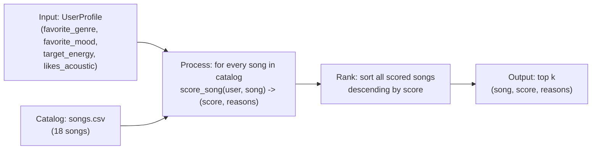

# 🎵 Music Recommender Simulation

## Project Summary

In this project you will build and explain a small music recommender system.

Your goal is to:

- Represent songs and a user "taste profile" as data
- Design a scoring rule that turns that data into recommendations
- Evaluate what your system gets right and wrong
- Reflect on how this mirrors real world AI recommenders

VibeFinder is a small content-based-filtering music recommender: it scores every
song in a catalog against a listener's stated taste profile (favorite genre,
favorite mood, target energy, whether they like acoustic songs), then ranks and
returns the top matches with a plain-language explanation of why each one made
the list.

---

## How The System Works

**Real-world systems** mostly combine two different approaches. **Collaborative
filtering** predicts what you'll like from *other users'* behavior ("people who
listened to what you listened to also liked X") — it needs no knowledge of the
song itself, but it can't recommend brand-new songs or help brand-new users
(the "cold-start" problem). **Content-based filtering** predicts from the
*item's own attributes* (genre, tempo, energy, mood) matched against a profile
of what you've liked before — it has no cold-start problem, and it's naturally
explainable, but on its own it tends to create **filter bubbles**: it can only
ever push you toward things similar to what you already liked, with no
built-in mechanism for genuine discovery. Spotify and similar platforms
combine both, plus NLP signals from playlist titles and lyrics.

**This project implements content-based filtering only.** That choice is
deliberate — it keeps the system simple and fully explainable, but it also
means the filter-bubble risk discussed above applies directly to what we build
here (see `model_card.md` for where that shows up in practice).

**What a `Song` uses:** `genre`, `mood`, `energy`, `tempo_bpm`, `valence`,
`danceability`, `acousticness` — genre and mood are categorical identity/tone
signals, energy and valence are continuous "how intense / how upbeat"
dimensions, and danceability/acousticness are secondary signals for
finer-grained taste (e.g. an explicit "I like acoustic songs" preference).

**What a `UserProfile` stores:** `favorite_genre`, `favorite_mood`,
`target_energy`, and `likes_acoustic` — a small, explicit taste profile rather
than anything inferred from behavior (there's no listening history to infer
from in this simulation).

**How scoring works:** categorical features (genre, mood) earn a flat bonus on
an exact match. Numerical features (energy) earn points based on *closeness*
to the target, not on being high or low in absolute terms — a song with
`energy = 0.75` should score well against a `target_energy = 0.8` even though
neither value is the "biggest" in the catalog. Concretely:
`points = weight * (1 - abs(song.energy - user.target_energy))`, since energy
is normalized 0.0–1.0, so a perfect match earns full weight and a total
mismatch earns zero.

**How songs get ranked:** scoring and ranking are deliberately two separate
steps. `score_song` only ever looks at *one* song at a time and has no idea
what else is in the catalog. `recommend_songs` runs `score_song` across the
*entire* catalog, then sorts everything by score (descending) and returns the
top `k`. You need both: a single score doesn't produce an order on its own,
and you can't rank anything without first scoring every candidate.

### The Dataset

Started from the 10-song starter catalog and added 8 more songs spanning
genres/moods the original set didn't cover (edm/energetic, country/nostalgic,
r&b/romantic, hip-hop/confident, metal/aggressive, folk/melancholic,
classical/dreamy, reggae/uplifting) — 18 songs total, 15 genres, 14 moods.
This matters for evaluation: a catalog that's mostly one genre can't reveal
whether the scoring logic actually discriminates between tastes, it'll just
always return the same handful of songs regardless of the user profile.

### The Default Taste Profile

```python
{"favorite_genre": "pop", "favorite_mood": "happy", "target_energy": 0.8, "likes_acoustic": False}
```

**Critique — is this too narrow?** Genre + mood + a single energy target can
tell "pop/happy" apart from "lofi/chill" easily (they differ on all three
axes). It's weaker at telling apart songs that share energy but differ in
emotional tone from genre/mood alone — e.g. "intense rock" at energy 0.91 and
a hypothetical "energetic happy pop" song at energy 0.9 are nearly
indistinguishable *on energy alone*; mood is doing all the disambiguating
work there, and mood match is all-or-nothing (no partial credit for
"adjacent" moods like happy vs. uplifting). `valence` (continuous
happy↔sad) is sitting right there in the data and would help here, but it's
intentionally left out of v1's scoring to keep the recipe simple — flagged in
`model_card.md` as a concrete future improvement rather than scope-creeping
it into the core implementation now.

### Algorithm Recipe (finalized)

| Signal | Type | Points |
|---|---|---|
| Genre exact match | categorical | **+2.0** |
| Mood exact match | categorical | **+1.0** |
| Energy closeness | numerical, similarity-based | up to **+1.5** — `1.5 * (1 - abs(song.energy - target_energy))` |
| Acoustic preference | conditional bonus | **+0.5** if `likes_acoustic` is `True` and `song.acousticness >= 0.6` |

Max possible score: **5.0**. Genre outweighs mood 2:1 because it's the
stronger, more stable identity signal (someone who wants rock is unlikely to
enjoy lofi regardless of mood match); energy gets a comparable ceiling to
genre so a strong energy match can still meaningfully move a song up even
without a genre/mood hit, rather than being drowned out entirely.

**Expected bias:** this recipe over-rewards catalog songs that happen to sit
exactly on a genre/mood label the user names, and under-rewards genuinely
similar-vibe songs that use a different label for a similar feeling (e.g.
"indie pop" vs. "pop", or "relaxed" vs. "chill"). Combined with no
`valence` scoring yet, a user who *feels* like they want "upbeat" music but
whose profile says `favorite_mood: happy` will miss songs tagged
`uplifting` even if their valence is just as high — a labeling-brittleness
bias we'll dig into further in Phase 4.

### Data Flow



---

## Getting Started

### Setup

1. Create a virtual environment (optional but recommended):

   ```bash
   python -m venv .venv
   source .venv/bin/activate      # Mac or Linux
   .venv\Scripts\activate         # Windows

2. Install dependencies

```bash
pip install -r requirements.txt
```

3. Run the app:

```bash
python -m src.main
```

### Running Tests

Run the starter tests with:

```bash
pytest
```

You can add more tests in `tests/test_recommender.py`.

---

## Sample Recommendation Output

Default profile: `{"favorite_genre": "pop", "favorite_mood": "happy", "target_energy": 0.8, "likes_acoustic": False}`

Output of `python -m src.main`:

```
Loaded songs: 18

Top recommendations:

Sunrise City - Score: 4.47
Because: genre match (+2.0); mood match (+1.0); energy closeness (+1.47)

Gym Hero - Score: 3.30
Because: genre match (+2.0); energy closeness (+1.30)

Rooftop Lights - Score: 2.44
Because: mood match (+1.0); energy closeness (+1.44)

Concrete Kingdom - Score: 1.50
Because: energy closeness (+1.50)

Night Drive Loop - Score: 1.42
Because: energy closeness (+1.42)
```

**Screenshot or video** *(optional)*: <!-- Insert a screenshot or demo video link here -->

---

## Experiments You Tried

Use this section to document the experiments you ran. For example:

- What happened when you changed the weight on genre from 2.0 to 0.5
- What happened when you added tempo or valence to the score
- How did your system behave for different types of users

---

## Limitations and Risks

Summarize some limitations of your recommender.

Examples:

- It only works on a tiny catalog
- It does not understand lyrics or language
- It might over favor one genre or mood

You will go deeper on this in your model card.

---

## Reflection

Read and complete `model_card.md`:

[**Model Card**](model_card.md)

Write 1 to 2 paragraphs here about what you learned:

- about how recommenders turn data into predictions
- about where bias or unfairness could show up in systems like this


