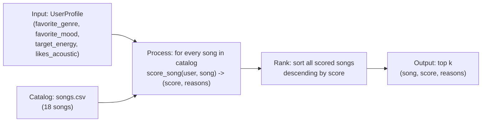

# 🎵 Music Recommender Simulation

## Project Summary

In this project you will build and explain a small music recommender system.

Your goal is to:

- Represent songs and a user "taste profile" as data
- Design a scoring rule that turns that data into recommendations
- Evaluate what your system gets right and wrong
- Reflect on how this mirrors real world AI recommenders

VibeSonar is a small content-based-filtering music recommender: it scores every
song in a catalog against a listener's stated taste profile (favorite genre,
favorite mood, target energy, whether they like acoustic songs), then ranks and
returns the top matches with a plain-language explanation of why each one made
the list.

---

## How The System Works

**Real-world systems** mostly combine two different approaches. **Collaborative
filtering** predicts what you'll like from *other users'* behavior ("people who
listened to what you listened to also liked X") — it needs no knowledge of the
song itself, but it can't recommend brand-new songs or help brand-new users
(the "cold-start" problem). **Content-based filtering** predicts from the
*item's own attributes* (genre, tempo, energy, mood) matched against a profile
of what you've liked before — it has no cold-start problem, and it's naturally
explainable, but on its own it tends to create **filter bubbles**: it can only
ever push you toward things similar to what you already liked, with no
built-in mechanism for genuine discovery. Spotify and similar platforms
combine both, plus NLP signals from playlist titles and lyrics.

**This project implements content-based filtering only.** That choice is
deliberate — it keeps the system simple and fully explainable, but it also
means the filter-bubble risk discussed above applies directly to what we build
here (see `model_card.md` for where that shows up in practice).

**What a `Song` uses:** `genre`, `mood`, `energy`, `tempo_bpm`, `valence`,
`danceability`, `acousticness` — genre and mood are categorical identity/tone
signals, energy and valence are continuous "how intense / how upbeat"
dimensions, and danceability/acousticness are secondary signals for
finer-grained taste (e.g. an explicit "I like acoustic songs" preference).

**What a `UserProfile` stores:** `favorite_genre`, `favorite_mood`,
`target_energy`, and `likes_acoustic` — a small, explicit taste profile rather
than anything inferred from behavior (there's no listening history to infer
from in this simulation).

**How scoring works:** categorical features (genre, mood) earn a flat bonus on
an exact match. Numerical features (energy) earn points based on *closeness*
to the target, not on being high or low in absolute terms — a song with
`energy = 0.75` should score well against a `target_energy = 0.8` even though
neither value is the "biggest" in the catalog. Concretely:
`points = weight * (1 - abs(song.energy - user.target_energy))`, since energy
is normalized 0.0–1.0, so a perfect match earns full weight and a total
mismatch earns zero.

**How songs get ranked:** scoring and ranking are deliberately two separate
steps. `score_song` only ever looks at *one* song at a time and has no idea
what else is in the catalog. `recommend_songs` runs `score_song` across the
*entire* catalog, then sorts everything by score (descending) and returns the
top `k`. You need both: a single score doesn't produce an order on its own,
and you can't rank anything without first scoring every candidate.

### The Dataset

Started from the 10-song starter catalog and added 8 more songs spanning
genres/moods the original set didn't cover (edm/energetic, country/nostalgic,
r&b/romantic, hip-hop/confident, metal/aggressive, folk/melancholic,
classical/dreamy, reggae/uplifting) — 18 songs total, 15 genres, 14 moods.
This matters for evaluation: a catalog that's mostly one genre can't reveal
whether the scoring logic actually discriminates between tastes, it'll just
always return the same handful of songs regardless of the user profile.

### The Default Taste Profile

```python
{"favorite_genre": "pop", "favorite_mood": "happy", "target_energy": 0.8, "likes_acoustic": False}
```

**Critique — is this too narrow?** Genre + mood + a single energy target can
tell "pop/happy" apart from "lofi/chill" easily (they differ on all three
axes). It's weaker at telling apart songs that share energy but differ in
emotional tone from genre/mood alone — e.g. "intense rock" at energy 0.91 and
a hypothetical "energetic happy pop" song at energy 0.9 are nearly
indistinguishable *on energy alone*; mood is doing all the disambiguating
work there, and mood match is all-or-nothing (no partial credit for
"adjacent" moods like happy vs. uplifting). `valence` (continuous
happy↔sad) is sitting right there in the data and would help here, but it's
intentionally left out of v1's scoring to keep the recipe simple — flagged in
`model_card.md` as a concrete future improvement rather than scope-creeping
it into the core implementation now.

### Algorithm Recipe (finalized)

| Signal | Type | Points |
|---|---|---|
| Genre exact match | categorical | **+2.0** |
| Mood exact match | categorical | **+1.0** |
| Energy closeness | numerical, similarity-based | up to **+1.5** — `1.5 * (1 - abs(song.energy - target_energy))` |
| Acoustic preference | conditional bonus | **+0.5** if `likes_acoustic` is `True` and `song.acousticness >= 0.6` |

Max possible score: **5.0**. Genre outweighs mood 2:1 because it's the
stronger, more stable identity signal (someone who wants rock is unlikely to
enjoy lofi regardless of mood match); energy gets a comparable ceiling to
genre so a strong energy match can still meaningfully move a song up even
without a genre/mood hit, rather than being drowned out entirely.

**Expected bias:** this recipe over-rewards catalog songs that happen to sit
exactly on a genre/mood label the user names, and under-rewards genuinely
similar-vibe songs that use a different label for a similar feeling (e.g.
"indie pop" vs. "pop", or "relaxed" vs. "chill"). Combined with no
`valence` scoring yet, a user who *feels* like they want "upbeat" music but
whose profile says `favorite_mood: happy` will miss songs tagged
`uplifting` even if their valence is just as high — a labeling-brittleness
bias we'll dig into further in Phase 4.

### Data Flow



---

## Getting Started

### Setup

1. Create a virtual environment (optional but recommended):

   ```bash
   python -m venv .venv
   source .venv/bin/activate      # Mac or Linux
   .venv\Scripts\activate         # Windows

2. Install dependencies

```bash
pip install -r requirements.txt
```

3. Run the app:

```bash
python -m src.main
```

### Running Tests

Run the starter tests with:

```bash
pytest
```

You can add more tests in `tests/test_recommender.py`.

---

## Sample Recommendation Output

Default profile: `{"favorite_genre": "pop", "favorite_mood": "happy", "target_energy": 0.8, "likes_acoustic": False}`

Output of `python -m src.main`:

```
Loaded songs: 18

Top recommendations:

Sunrise City - Score: 4.47
Because: genre match (+2.0); mood match (+1.0); energy closeness (+1.47)

Gym Hero - Score: 3.30
Because: genre match (+2.0); energy closeness (+1.30)

Rooftop Lights - Score: 2.44
Because: mood match (+1.0); energy closeness (+1.44)

Concrete Kingdom - Score: 1.50
Because: energy closeness (+1.50)

Night Drive Loop - Score: 1.42
Because: energy closeness (+1.42)
```

**Screenshot or video** *(optional)*: <!-- Insert a screenshot or demo video link here -->

---

## Experiments You Tried

### Stress-testing with five profiles

Ran `evaluate()` in `src/main.py` (three "normal" tastes + two adversarial
ones) against the 18-song catalog. Full output:

```
Loaded songs: 18

=== High-Energy Pop ===
Profile: {'favorite_genre': 'pop', 'favorite_mood': 'happy', 'target_energy': 0.9, 'likes_acoustic': False}
Sunrise City - Score: 4.38
Because: genre match (+2.0); mood match (+1.0); energy closeness (+1.38)
Gym Hero - Score: 3.46
Because: genre match (+2.0); energy closeness (+1.46)
Rooftop Lights - Score: 2.29
Because: mood match (+1.0); energy closeness (+1.29)
Storm Runner - Score: 1.48
Because: energy closeness (+1.48)
Neon Pulse - Score: 1.43
Because: energy closeness (+1.43)

=== Chill Lofi ===
Profile: {'favorite_genre': 'lofi', 'favorite_mood': 'chill', 'target_energy': 0.35, 'likes_acoustic': True}
Library Rain - Score: 5.00
Because: genre match (+2.0); mood match (+1.0); energy closeness (+1.50); acoustic match (+0.5)
Midnight Coding - Score: 4.89
Because: genre match (+2.0); mood match (+1.0); energy closeness (+1.40); acoustic match (+0.5)
Focus Flow - Score: 3.92
Because: genre match (+2.0); energy closeness (+1.42); acoustic match (+0.5)
Spacewalk Thoughts - Score: 2.90
Because: mood match (+1.0); energy closeness (+1.40); acoustic match (+0.5)
Coffee Shop Stories - Score: 1.97
Because: energy closeness (+1.47); acoustic match (+0.5)

=== Deep Intense Rock ===
Profile: {'favorite_genre': 'rock', 'favorite_mood': 'intense', 'target_energy': 0.9, 'likes_acoustic': False}
Storm Runner - Score: 4.48
Because: genre match (+2.0); mood match (+1.0); energy closeness (+1.48)
Gym Hero - Score: 2.46
Because: mood match (+1.0); energy closeness (+1.46)
Neon Pulse - Score: 1.43
Because: energy closeness (+1.43)
Iron Requiem - Score: 1.40
Because: energy closeness (+1.40)
Sunrise City - Score: 1.38
Because: energy closeness (+1.38)

=== Adversarial: Happy Metal (conflicting genre/mood) ===
Profile: {'favorite_genre': 'metal', 'favorite_mood': 'happy', 'target_energy': 0.9, 'likes_acoustic': False}
Iron Requiem - Score: 3.40
Because: genre match (+2.0); energy closeness (+1.40)
Sunrise City - Score: 2.38
Because: mood match (+1.0); energy closeness (+1.38)
Rooftop Lights - Score: 2.29
Because: mood match (+1.0); energy closeness (+1.29)
Storm Runner - Score: 1.48
Because: energy closeness (+1.48)
Gym Hero - Score: 1.46
Because: energy closeness (+1.46)

=== Adversarial: Unknown Genre (not in catalog) ===
Profile: {'favorite_genre': 'k-pop', 'favorite_mood': 'happy', 'target_energy': 0.7, 'likes_acoustic': False}
Rooftop Lights - Score: 2.41
Because: mood match (+1.0); energy closeness (+1.41)
Sunrise City - Score: 2.32
Because: mood match (+1.0); energy closeness (+1.32)
Night Drive Loop - Score: 1.42
Because: energy closeness (+1.42)
Concrete Kingdom - Score: 1.35
Because: energy closeness (+1.35)
Golden Hour Sway - Score: 1.35
Because: energy closeness (+1.35)
```

**What this revealed:**

- **Chill Lofi hit the max possible score (5.00)** on Library Rain — a song
  that matches all four signals at once. That's the system working exactly
  as designed, and it "feels" right: Library Rain and Midnight Coding are
  genuinely close in vibe to what a lofi/chill/low-energy/acoustic listener
  wants.
- **The adversarial "Happy Metal" profile is the most revealing result.**
  Iron Requiem — a song explicitly tagged `mood=aggressive` — won *first
  place* for a user who asked for `favorite_mood=happy`, purely because it's
  the only metal song in the catalog and genre match (+2.0) outweighs the
  missing mood match. A real listener asking for "happy" music would likely
  be unhappy (no pun intended) to get handed an aggressive metal track. This
  confirms the bias flagged in Phase 2: **genre can override mood in a way
  that doesn't match user intent** when a genre is thin (only one song deep).
- **The "Unknown Genre" profile degraded gracefully** — with `k-pop` matching
  nothing in the catalog, the system fell back cleanly to mood + energy
  matches instead of erroring or returning nothing. Good defensive behavior,
  but it also means an unmatched genre silently becomes invisible instead of
  being flagged to the user ("we don't have any k-pop, showing closest mood
  matches instead" would be more honest — see Future Work in `model_card.md`).

### Weight-shift experiment: genre 2.0→1.0, energy 1.5→3.0

Tested (not shipped — reverted after) doubling energy's weight and halving
genre's, on the Default and Deep Intense Rock profiles:

```
Default Pop/Happy — BEFORE: Sunrise City 4.47, Gym Hero 3.30, Rooftop Lights 2.44
Default Pop/Happy — AFTER:  Sunrise City 4.94, Rooftop Lights 3.88, Gym Hero 3.61

Deep Intense Rock — BEFORE: Storm Runner 4.48, Gym Hero 2.46, Neon Pulse 1.43
Deep Intense Rock — AFTER:  Storm Runner 4.97, Gym Hero 3.91, Neon Pulse 2.85
```

**The interesting part isn't the score changes, it's the rank-order flip**:
under the original weights, Gym Hero (genre match, no mood match) beats
Rooftop Lights (mood match, no genre match) for the Default profile. Under
the shifted weights, **Rooftop Lights overtakes Gym Hero** — because energy
closeness now dominates enough that a very close energy match (Rooftop:
gap 0.04) outweighs a genre match paired with a middling energy match (Gym
Hero: gap 0.13). Whether this is "more accurate" is genuinely debatable, not
a clear win: Rooftop Lights does share the user's stated mood, which arguably
makes it a *better* recommendation than the genre-only match — but it also
shows the system is quite sensitive to weight choices, and a small tuning
change reshuffles results in ways a user would definitely notice. This is
exactly the kind of tuning fragility real recommender teams spend a lot of
time on (A/B testing weight changes, not just picking numbers that "feel
right").

---

## Limitations and Risks

- Tiny catalog (18 songs) with uneven genre coverage — 13 of 15 genres have
  only one song, so most "genre match" recommendations aren't actually
  competing against alternatives.
- Genre match (+2.0) can outweigh a mood mismatch entirely when a genre only
  has one song — confirmed with an adversarial "happy metal" test that
  returned an aggressive-mood song to a user who asked for happy music.
- No lyric, vocal, or production-style understanding at all — purely
  structured-attribute matching.
- `valence` is tracked in the data but not scored, so mood-label matches
  don't account for how happy/sad a song actually sounds within that label.

Full analysis, including catalog composition data and the weight-shift
experiment, is in `model_card.md`.

---

## Reflection

Read and complete `model_card.md`:

[**Model Card**](model_card.md)

Write 1 to 2 paragraphs here about what you learned:

- about how recommenders turn data into predictions
- about where bias or unfairness could show up in systems like this

Building this made it obvious that "prediction" here is really just
weighted arithmetic over labeled attributes — a recommender turns data into
a suggestion by scoring every candidate against a stated (or inferred) target
and sorting the results. There's no magic step where the system "understands"
music; it's comparing numbers and category labels, and the quality of the
result is entirely bounded by how well those attributes actually capture
what a listener means by "vibe."

Bias showed up in two concrete, testable ways rather than as an abstract
worry: catalog composition (genres with only one song can't produce a
genuinely competitive recommendation) and weight design (a strong genre
weight can steamroll a conflicting mood signal instead of surfacing the
conflict honestly). Neither came from a coding mistake — both came from
reasonable-looking design decisions interacting in ways that only became
visible once I deliberately tried to break the system with adversarial
profiles. That's the main takeaway: a recommender can be bug-free and still
be unfair, and finding that requires testing for it on purpose, not just
checking that the "happy path" looks right.

